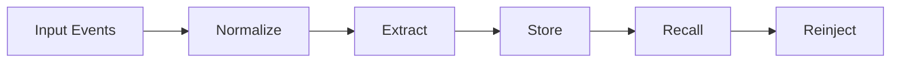

# Wisdom AgentDB

> A memory database for AI agents: capture experience, persist context, recall what matters, and keep every memory traceable.

## Why this exists

Most agents are stateless.
They can talk, search, and act, but they forget the decisions, preferences, and project context that make them useful over time.

Wisdom AgentDB is designed to fix that.

It is a memory stack for agents that treats memory as a first-class product primitive:

- session memory
- project memory
- user memory
- semantic retrieval
- graph relationships
- citations and provenance
- privacy and retention controls

## What it is

Wisdom AgentDB is an open, self-hostable memory platform for AI agents.
It is built to support:

- coding agents
- personal AI assistants
- research copilots
- workflow automations
- multi-agent systems

## Core principles

- **Memory is structured.**
  Memory is not a blob of text. It is typed, scoped, and traceable.

- **Memory is layered.**
  Short-term session state, long-term facts, semantic recall, and agent instructions are separate concerns.

- **Memory is auditable.**
  Every stored item should have source, timestamp, scope, and citation lineage.

- **Memory is private by default.**
  Users should be able to exclude, delete, export, and retain data intentionally.

- **Memory is composable.**
  The system should work across CLI, web, SDKs, and plugins without changing the core data model.

## Architecture at a glance



### Backend

- Python memory engine
- async workers
- retrieval and ranking
- graph and temporal facts
- policy and retention enforcement

### Clients

- TypeScript CLI
- TypeScript web app
- TypeScript SDK
- editor and agent integrations

### Storage

- relational metadata store
- vector index for semantic recall
- graph store for facts and relationships
- object store for raw documents and exports

## What we borrow from the best OSS memory systems

- **Mem0**: memory API, semantic retrieval, graph memory
- **Zep**: temporal facts, summaries, and relationship tracking
- **Letta**: stateful agents and memory blocks
- **claude-mem**: session capture, compaction, citations, privacy controls
- **Autohand**: project-local instructions, skills, and context compaction
- **Khoj**: document ingestion, semantic search, and automations

## What makes Wisdom different

- one canonical memory schema
- one event model across all clients
- one policy layer for privacy and retention
- one product surface built on top of multiple proven memory patterns
- no black-box memory store

## Target capabilities

- save and recall agent memory across sessions
- keep project instructions and preferences separate
- search by meaning, not just keywords
- store facts with timestamps and provenance
- export/import memory between environments
- support async ingestion and summarization
- make memory visible, editable, and deletable

## Suggested stack

- **Python** for the core memory engine
- **TypeScript** for CLI, SDK, and web surfaces
- **Postgres** for metadata, sessions, policies, and audit trail
- **Vector DB** for semantic memory
- **Graph DB** for facts and relations
- **Object storage** for raw artifacts and exports

## Repo structure

```text
architecture/   architecture docs and contracts
docs/           research and benchmark analysis
```

## Documentation

- [Docs index](docs/README.md)
- [Architecture index](architecture/README.md)
- [Architecture overview](docs/architecture-overview.md)
- [Benchmark notes](docs/benchmark-notes.md)
- [Decision log](docs/decision-log.md)

## Roadmap

### Phase 1

- canonical event schema
- memory API
- scope model
- ingestion and search

### Phase 2

- graph memory
- temporal facts
- citations
- export/import

### Phase 3

- project-local instructions
- skills and agent state
- automations
- UI and integrations

## Contributing

Contributions are welcome, especially around:

- retrieval quality
- schema design
- policy and privacy
- client SDKs
- integrations

## License

MIT
