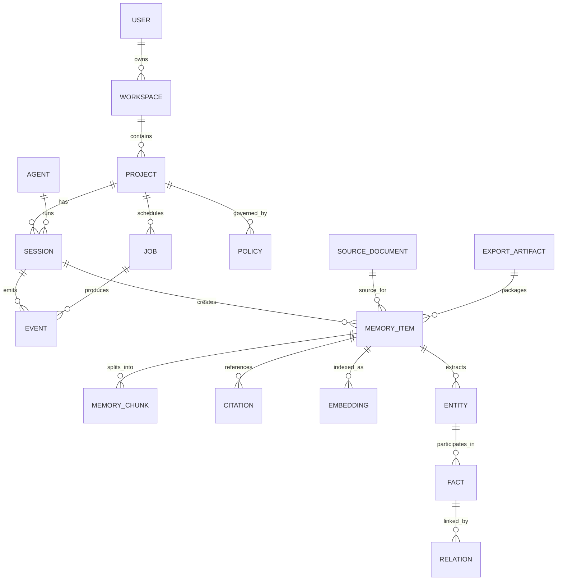

# ERD

## Entities

- `User`
- `Agent`
- `Workspace`
- `Project`
- `Session`
- `MemoryItem`
- `MemoryChunk`
- `Entity`
- `Fact`
- `Relation`
- `Citation`
- `SourceDocument`
- `Embedding`
- `Policy`
- `Job`
- `Event`
- `ExportArtifact`

## Relationships

## Notes

- `Session` is the primary episodic scope.
- `MemoryItem` is the canonical stored memory unit.
- `MemoryChunk` is the searchable fragment used for retrieval.
- `Entity`, `Fact`, and `Relation` represent the graph layer.
- `Policy` controls privacy, retention, and export rules.
- `ExportArtifact` allows portable memory exchange.

